# Digital-Image-Processing

## Brain MRI Project

This project works with two brain MRI datasets and is organized into three
tasks:

```text
Task 1: Super-resolution
Task 2: CNN tumor classification
Task 3: YOLO detection
```

Datasets:

```text
Data 1: Kaggle brain MRI tumor/no-tumor classification dataset
        navoneel/brain-mri-images-for-brain-tumor-detection

Data 2: MRI tumor segmentation dataset with masks, converted to YOLO format
```

## Objective And Experiment Design

The objective of this project is to evaluate the robustness of image-processing
and computer-vision algorithms/models when MRI images are changed by different
distortions. The project measures how much performance degrades after
distortion, and then checks whether restoration or model fine-tuning can improve
the results.

The project follows this experiment structure:

| Requirement | Project implementation |
| --- | --- |
| Select a public dataset | Data 1 uses the Kaggle brain MRI tumor/no-tumor dataset. Data 2 uses an MRI tumor segmentation dataset with masks. |
| Select 3 distortions | Gaussian noise, salt-and-pepper noise, and gaussian blur. YOLO also includes brightness/contrast levels. |
| Select 3 tasks | Task 1: super-resolution. Task 2: CNN tumor classification. Task 3: YOLO tumor segmentation. |
| Select a model/algorithm for each task | CNN classifier, interpolation-based super-resolution algorithms, and YOLO segmentation. |
| Baseline | Measure performance on clean images. |
| Distortion | Apply distortions and measure degradation. |
| Improvement 1 | Restore/enhance distorted images before evaluation. |
| Improvement 2 | Fine-tune deep-learning models on distorted data. |

The main distortions and levels are:

| Distortion | Levels |
| --- | --- |
| Gaussian noise | SNR 5, 10, 15, 20, 30 dB |
| Salt-and-pepper noise | density 0.01, 0.03, 0.05, 0.10 |
| Gaussian blur | sigma 0.5, 1.0, 1.5, 2.0, 3.0 |
| Brightness/contrast for YOLO | B1.15 C1.25, B1.35 C1.55, B1.55 C1.80 |

For each task, the project compares clean baseline, distorted input, restored
input, and fine-tuned models when fine-tuning is relevant:

| Task | Baseline | Distortion test | Restoration / enhancement | Fine-tuning |
| --- | --- | --- | --- | --- |
| Task 1 super-resolution | `super_resolution\Clean` | `super_resolution_snr\distortions` | `super_resolution_snr\restoration` | Not used, because this task uses classical interpolation algorithms. |
| Task 2 CNN classification | `cnn_on_basic` | `cnn_on_distortion` | `cnn_on_distortion_restoration` | `cnn_fine_tune_distortion` |
| Task 3 YOLO segmentation | `yolo_basic` | `yolo_basic_on_distortion_levels` | `yolo_basic_on_restored_distortion_levels` | `yolo_fine_tuned` |

The measurements are saved as CSV tables and visualized with bar plots, curves,
confusion matrices, before/after images, and YOLO annotated output images.

## Setup

Setup commands are listed in the **How To Run** section at the end of this file.

## Data 1 Preparation For CNN And Super-Resolution

`data\Data 1` is used for Task 1 super-resolution and Task 2 CNN classification
super-resolution.

The Data 1 download and preprocessing commands are listed in the **How To Run**
section.

Processed files are saved into:

```text
data\Data 1\
  train\
  val\
  test\
```

Data 1 examples:

```text
No tumor image:
data\Data 1\test\no_tumor\14 no_28.jpg

Tumor image:
data\Data 1\test\tumor\Y115_5.jpg
```

The label is the folder name: `no_tumor` or `tumor`.

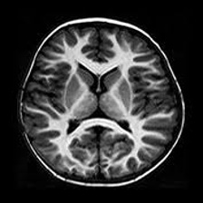

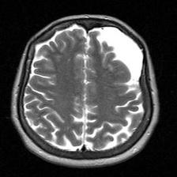

## Shared Distortion and Restoration

Distortion and restoration are shared experiments. They can be used by all
tasks:

```text
Task 1 can run super-resolution on distorted/restored images.
Task 2 can run the CNN on distorted/restored images.
Task 3 can run YOLO on distorted/restored images.
```

Common digital image distortion methods can be applied to one image.

If `--image` is not provided, the script uses one image from
`data\Data 1\test`.

Distortion outputs are saved to:

```text
data\Data 1 with distortion\distortions\
  distortion_grid.png
  methods.txt
  gaussian_noise.png
  salt_and_pepper.png
  gaussian_blur.png
  brightness_contrast.png
  rotation.png
  perspective_warp.png
  barrel_distortion.png
  pixelation.png
```

Restoration techniques can be applied to the distortion outputs.

Run `distortion_methods.py` first, because this script uses files from
`data\Data 1 with distortion\distortions`.

How each distortion and restoration works:

| Distortion | How the distortion works | How the restoration works |
| --- | --- | --- |
| Gaussian noise | Adds random normally distributed pixel noise to the image. | Applies light Gaussian smoothing to reduce noise, then unsharp masking to recover edges. |
| Salt-and-pepper noise | Randomly changes pixels to black or white. | Uses a median filter, which removes isolated black/white pixels while keeping edges better than simple blur. |
| Gaussian blur | Smooths the image with a Gaussian filter, reducing details and edges. | Uses unsharp masking to increase local contrast and make edges sharper again. |
| Brightness/contrast | Increases brightness and contrast, changing intensity distribution. | Uses autocontrast and then lowers contrast to normalize image intensity. |
| Rotation | Rotates the image by 18 degrees and fills empty areas with black. | Rotates the image back by -18 degrees. Some border information can still be lost. |
| Perspective warp | Moves the image corners to simulate a changed camera/view angle. | Applies the inverse perspective transform using the same corner mapping. |
| Barrel distortion | Bends pixels outward from the image center. | Applies a pincushion-style correction to bend pixels back toward the original geometry. |
| Pixelation | Downsamples the image into large blocks and resizes it back with nearest-neighbor interpolation. | Uses bicubic interpolation and mild sharpening to smooth block edges. Lost detail cannot be fully recovered. |

Restoration outputs are saved to:

```text
data\Data 1 with distortion\restoration\
  restoration_grid.png
  methods.txt
  gaussian_noise_restored.png
  salt_and_pepper_restored.png
  gaussian_blur_restored.png
  brightness_contrast_restored.png
  rotation_restored.png
  perspective_warp_restored.png
  barrel_distortion_restored.png
  pixelation_restored.png
```

Distortion and restoration result images:


## Task 1: Super-Resolution

This task downsamples an MRI image by x2 and reconstructs it back to the original
size using interpolation-based super-resolution techniques.

It can run on the default image or on a selected image.

Outputs are saved to:

```text
result\results task 1\super_resolution\
  original.png
  downsampled_x2.png
  downsampled_x2_preview.png
  nearest.png
  bilinear.png
  bicubic.png
  lanczos.png
  sharpened_lanczos.png
  super_resolution_grid.png
  metrics.csv
  methods.txt
```

It can also run super-resolution on distortion and restoration images.

Additional outputs are saved to:

```text
result\results task 1\super_resolution\distortions\
result\results task 1\super_resolution\restoration\
```

The SNR/level super-resolution experiment is also available.

Outputs are saved to:

```text
result\results task 1\super_resolution_snr\
  distortions\
  restoration\
  super_resolution_results\
  snr_super_resolution_metrics.csv
  gaussian_noise_snr_psnr_graph.png
  salt_and_pepper_density_psnr_graph.png
  gaussian_blur_sigma_psnr_graph.png
```

Task 1 main metric:

```text
PSNR: higher is better.
```

In `super_resolution_snr`, distorted images are compared to the distorted
input, and restored images are compared to the restored input. The PSNR table
and the super-resolution example images below use the `sharpened_lanczos`
reconstruction method.

| Distortion | Level | Image type | PSNR | Input image | Downsampled x2 | Super-resolution |
| --- | --- | --- | ---: | --- | --- | --- |
| gaussian_noise_snr | 5db | distorted | 17.25 |  | 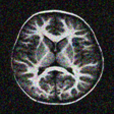 | 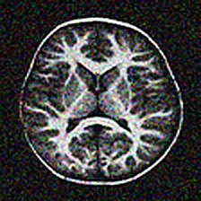 |
| gaussian_noise_snr | 5db | restored | 27.35 | 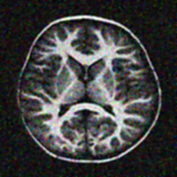 | 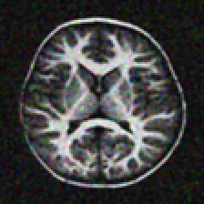 | 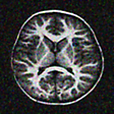 |
| gaussian_noise_snr | 30db | distorted | 26.74 | 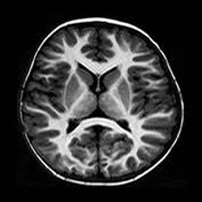 | 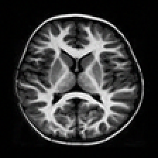 | 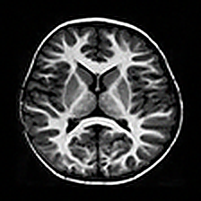 |
| gaussian_noise_snr | 30db | restored | 28.14 | 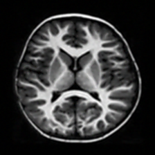 | 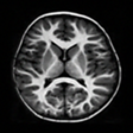 | 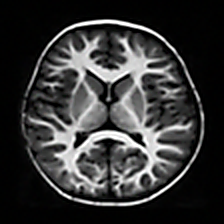 |
| salt_and_pepper_density | 0.01 | distorted | 22.68 |  |  | 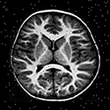 |
| salt_and_pepper_density | 0.01 | restored | 27.79 |  | 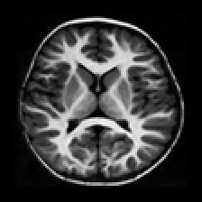 |  |
| salt_and_pepper_density | 0.10 | distorted | 14.95 | 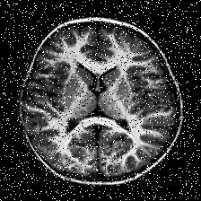 | 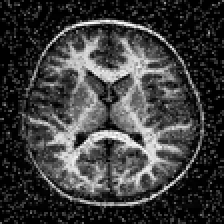 | 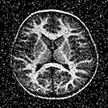 |
| salt_and_pepper_density | 0.10 | restored | 27.31 |  |  | 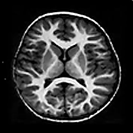 |
| gaussian_blur_sigma | 0.5 | distorted | 27.50 |  |  | 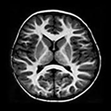 |
| gaussian_blur_sigma | 3.0 | distorted | 43.95 |  |  |  |

Task 1 visualization files:

```text
result\results task 1\super_resolution\detailed_psnr_graph.png
result\results task 1\super_resolution\vs_original_psnr_graph.png
result\results task 1\super_resolution_snr\gaussian_noise_snr_psnr_graph.png
result\results task 1\super_resolution_snr\salt_and_pepper_density_psnr_graph.png
result\results task 1\super_resolution_snr\gaussian_blur_sigma_psnr_graph.png
```

Super-resolution result images:


## Task 2: CNN Tumor Classification

Task 2 trains a CNN binary classifier that predicts whether an MRI image has a
tumor.

Task 2 uses the same Data 1 MRI images as Task 1 super-resolution. It also uses
the same shared distortion and restoration techniques described above, so CNN
results can be compared on clean, distorted, and restored versions of the same
image data.

The normal CNN can be trained on clean Data 1 images.

The trained model is saved to:

```text
models\cnn_basic.keras
```

Results are saved to:

```text
result\results task 2\cnn_on_basic\
  training_history.png
  confusion_matrix.png
  metrics.txt
  predictions.csv
```

The augmented CNN uses a larger training set with rotated copies.

This writes:

```text
data\Data 1 augmented\
```

CNN augmentation example:

```text
Original training image:
data\Data 1\train\no_tumor\1 no_23.jpg

Augmented rotated image:
data\Data 1 augmented\train\no_tumor\1 no_23_rot_20p0.jpg
```

The augmented image is the same MRI rotated by 20 degrees.

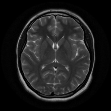

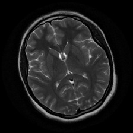

The CNN can also be trained on the augmented dataset.

Augmentation note:

The basic CNN was improved by trying data augmentation. The reason for this
choice was that Data 1 is not very large, so adding augmented training images
could give the CNN more examples to learn from. After many runs, augmentation
did improve the model, but only by a small amount. The main conclusion was that
changing the position or rotation of the head does not help very much for this
dataset.

The augmented model is saved to:

```text
models\cnn_augmented.keras
```

Augmented results are saved to:

```text
result\results task 2\cnn_on_augmented\
  training_history.png
  confusion_matrix.png
  metrics.txt
  predictions.csv
```

Fine-tuned distortion CNN results should be saved to:

```text
result\results task 2\cnn_fine_tune_distortion\
```

The trained basic CNN can be evaluated on clean and distorted images only.

The distortion-only CNN outputs are saved to:

```text
result\results task 2\cnn_on_distortion\
  cnn_predictions_all_images.csv
  summary_all_images.txt
  confusion_percentages.csv
  total_true_percent_graph.png
```

Predict one image:

Single-image prediction is also supported.

The trained CNN can also run on shared distortion and restoration images.

The CNN comparison outputs are saved to:

```text
result\results task 2\cnn_on_distortion_restoration\
  cnn_predictions_all_images.csv
  summary_all_images.txt
  confusion_percentages.csv
  total_true_percent_graph.png
  snr_total_true_percent_graph.png
  salt_and_pepper_total_true_percent_graph.png
  gaussian_blur_total_true_percent_graph.png
```

CNN result images:

Main metric shown: **total true percent**.

Basic CNN on clean Data 1:


Augmented CNN on Data 1 with rotated training images:


## Data 2 Preparation For YOLO

`data\Data 2` is for the YOLO MRI segmentation dataset.

The Data 2 download command is listed in the **How To Run** section.

The YOLO dataset is saved under:

```text
data\Data 2\mri_segmentation\
```

Example Data 2 YOLO segmentation item:

```text
image:
data\Data 2\yolo_segmentation\images\train\kaggle_3m__TCGA_CS_4941_19960909__TCGA_CS_4941_19960909_11.tif

label:
data\Data 2\yolo_segmentation\labels\train\kaggle_3m__TCGA_CS_4941_19960909__TCGA_CS_4941_19960909_11.txt

label content starts like:
0 0.492188 0.257812 0.476562 0.257812 0.468750 0.265625 ...
```

In the label file, `0` is the class id for `tumor`. The following numbers are
normalized x/y polygon points that mark the tumor mask.

Example Data 2 image:


Example Data 2 image with tumor mask:


## Task 3: YOLO Tumor Segmentation

YOLO can mark tumor regions if it is trained as a segmentation model. Data 2
uses the LGG MRI segmentation dataset masks and converts them into YOLO
segmentation labels.

Data 2 is downloaded and converted into YOLO segmentation format.

This creates:

```text
data\Data 2\yolo_segmentation\
  data.yaml
  images\train\
  images\val\
  images\test\
  labels\train\
  labels\val\
  labels\test\
```

YOLO segmentation can be trained on the prepared segmentation dataset.

The trained tumor segmentation model is copied to:

```text
models\yolo\yolo_tumor_seg.pt
```

The trained model can be used to mark tumors.

Tumor segmentation outputs are saved to:

```text
result\results task 3\yolo_tumor_segmentation\
  tumor_segmentation_predictions.csv
  annotated\
  labels\
```

YOLO distortion-level experiments compare the clean basic model, restored
inputs, and fine-tuned models.

YOLO distortion-level results are saved to:

```text
result\results task 3\yolo_snr_results\
  yolo_distortion_level_metrics.csv
  yolo_basic_distortion_level_metrics.csv
  yolo_basic_restored_distortion_level_metrics.csv
  yolo_gaussian_noise_snr_map50_graph.png
  yolo_gaussian_blur_sigma_map50_graph.png
  yolo_brightness_contrast_level_map50_graph.png
```

YOLO result images:

Main metric shown: **mAP50**.


## Documentation Of Choices, Processing, And Results

### Project Choices

| Area | Choice |
| --- | --- |
| Data 1 | Brain MRI tumor/no-tumor image classification data. |
| Data 2 | MRI segmentation data converted into YOLO segmentation format with images, masks, and YOLO labels. |
| Task 1 | x2 downsample then reconstruct using nearest, bilinear, bicubic, lanczos, and sharpened_lanczos. |
| Task 2 | CNN binary classifier for tumor vs no tumor. |
| Task 3 | YOLO segmentation for marking tumor regions. |
| Distortion levels | Gaussian noise SNR, salt-and-pepper density, gaussian blur sigma, and YOLO brightness/contrast levels. |
| Restoration | Noise uses smoothing/sharpening, salt-and-pepper uses median filtering, blur uses unsharp masking, brightness/contrast uses intensity normalization. |

### Input And Output Processing Steps

1. Data 1 images are downloaded and split into `train`, `val`, and `test`.
2. CNN inputs are resized and classified as tumor or no tumor.
3. Distorted images are generated from clean MRI images.
4. Restored images are generated from distorted images.
5. Super-resolution downsamples each input by x2, then reconstructs it back to 224x224.
6. Data 2 masks are converted to YOLO segmentation labels.
7. YOLO outputs annotated images with predicted tumor masks.

Important before/after and annotation outputs:

```text
data\Data 1 with distortion\distortions\distortion_grid.png
data\Data 1 with distortion\restoration\restoration_grid.png
result\results task 1\super_resolution\Clean\super_resolution_grid.png
result\results task 1\super_resolution_snr\super_resolution_results\
result\results task 3\yolo_tumor_segmentation\annotated\
```

### Task 2 CNN Measurements

CNN main metric:

```text
Total true percent = correct predictions / all predictions
```

Selected results from `result\results task 2\cnn_on_distortion_restoration\confusion_percentages.csv`:

| Source | Total true % | Total images |
| --- | ---: | ---: |
| clean original | 78.95 | 38 |
| gaussian_noise distorted | 71.05 | 38 |
| gaussian_noise restored | 68.42 | 38 |
| salt_and_pepper distorted | 44.73 | 38 |
| salt_and_pepper restored | 73.68 | 38 |
| gaussian_blur distorted | 60.53 | 38 |
| gaussian_blur restored | 60.53 | 38 |

CNN visualization files:

```text
result\results task 2\cnn_on_basic\training_history.png
result\results task 2\cnn_on_basic\confusion_matrix.png
result\results task 2\cnn_on_distortion\total_true_percent_graph.png
result\results task 2\cnn_on_distortion_restoration\total_true_percent_graph.png
result\results task 2\cnn_fine_tune_distortion\total_true_percent_graph.png
result\results task 2\cnn_compare_snr_distortion_restoration_fine_tune_total_true_percent_graph.png
result\results task 2\cnn_compare_salt_and_pepper_distortion_restoration_fine_tune_total_true_percent_graph.png
result\results task 2\cnn_compare_gaussian_blur_distortion_restoration_fine_tune_total_true_percent_graph.png
```

### Task 3 YOLO Measurements

YOLO segmentation main metric:

```text
mAP50: mask average precision at IoU 0.50.
```

Selected results from `result\results task 3\yolo_snr_results\yolo_distortion_level_metrics.csv`:

| Distortion | Level | Basic mAP50 | Basic restored mAP50 | Fine-tuned mAP50 |
| --- | --- | ---: | ---: | ---: |
| gaussian_noise_snr | 5db | 0.696 | 0.774 | 0.782 |
| gaussian_noise_snr | 15db | 0.828 | 0.829 | 0.839 |
| gaussian_noise_snr | 30db | 0.847 | 0.838 | 0.849 |
| gaussian_blur_sigma | 0.5 | 0.839 | 0.818 | 0.859 |
| gaussian_blur_sigma | 3.0 | 0.787 | 0.794 | 0.831 |
| brightness_contrast | B1.15 C1.25 | 0.843 | 0.837 | 0.857 |
| brightness_contrast | B1.55 C1.80 | 0.815 | 0.813 | 0.850 |

YOLO visualization files:

```text
result\results task 3\yolo_basic\train\confusion_matrix.png
result\results task 3\yolo_basic\train\results.png
result\results task 3\yolo_snr_results\yolo_gaussian_noise_snr_map50_graph.png
result\results task 3\yolo_snr_results\yolo_gaussian_blur_sigma_map50_graph.png
result\results task 3\yolo_snr_results\yolo_brightness_contrast_level_map50_graph.png
```

### Measurements Summary

| Task | Measurements | Main plots |
| --- | --- | --- |
| Task 1 Super-resolution | PSNR | PSNR heatmaps and bar plots |
| Task 2 CNN | total true percent | bar plots comparing clean, distorted, restored, and fine-tuned CNN results |
| Task 3 YOLO | mask mAP50 | mAP50 bar plots comparing basic, restored, and fine-tuned YOLO |

## Future Enhancements

Planned improvements are tracked in:

```text
ENHANCEMENTS.md
```

GitHub issue templates are included for:

```text
CNN enhancement
Super-resolution enhancement
YOLO enhancement
```

## Notes

This project is for learning and experimentation. It is not a medical diagnostic
tool and should not be used for clinical decisions.

## How To Run

Create and activate the virtual environment:

```bash
python -m venv venv
venv\Scripts\activate
pip install -r requirements.txt
```

Prepare Data 1 for super-resolution and CNN:

```bash
python "data\Data 1\download_dataset.py"
python "data\Data 1\preprocess.py" --input "PASTE_DATASET_PATH_HERE"
```

Run shared distortion and restoration:

```bash
python "task\distortion methods\distortion_methods.py" --image "path\to\image.jpg"
python "task\restoration\image_restoration.py"
```

Run Task 1 super-resolution:

```bash
python "task\task 1 super resalution\super_resolution.py"
python "task\task 1 super resalution\super_resolution.py" --image "path\to\image.jpg"
python "task\task 1 super resalution\super_resolution.py" --include-derived
python "task\task 1 super resalution\super_resolution_snr.py"
```

Run Task 2 CNN:

```bash
python "task\task 2 cnn\train_cnn.py"
python "task\augmentation\augment_train_rotate.py"
python "task\task 2 cnn\train_cnn_augmented.py"
python "task\task 2 cnn\evaluate_distortion.py"
python "task\task 2 cnn\predict.py" --image "path\to\image.jpg"
python "task\task 2 cnn\evaluate_distortion_restoration.py"
```

Prepare Data 2 and run Task 3 YOLO:

```bash
python "data\Data 2\download_mri_data.py"
python "task\task 3 yolo\prepare_yolo_segmentation.py"
python "task\task 3 yolo\train_yolo_segmentation.py"
python "task\task 3 yolo\run_yolo_segmentation.py"
```

Run YOLO distortion-level experiments:

```bash
python "task\task 3 yolo\prepare_yolo_distorted_segmentation.py"
python "task\task 3 yolo\prepare_yolo_restored_segmentation.py"
python "task\task 3 yolo\validate_yolo_basic_on_distortion_levels.py"
python "task\task 3 yolo\validate_yolo_basic_on_restored_distortion_levels.py"
python "task\task 3 yolo\plot_yolo_snr_results.py"
```
